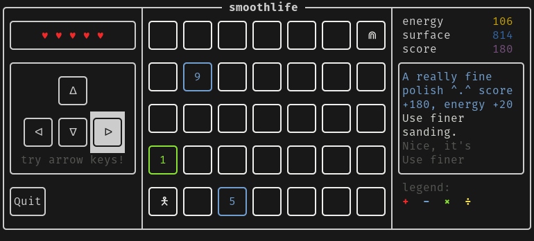

# smoothlife

## About

In this little number crunching game you play the dream of a polisher. It's still a bit buggy and not as polished as it should be but it's amusing to play anyways and was definitly a lot of fun to develop :D

This is a submission for the 2022 [C++ best practices game jam](https://github.com/cpp-best-practices/game_jam)
based on [ftxui template](https://github.com/cpp-best-practices/ftxui_template)

## More Details

 * [Dependency Setup](README_dependencies.md)
 * [Building Details](README_building.md)
 * [Troubleshooting](README_troubleshooting.md)
 * [Docker](README_docker.md)
